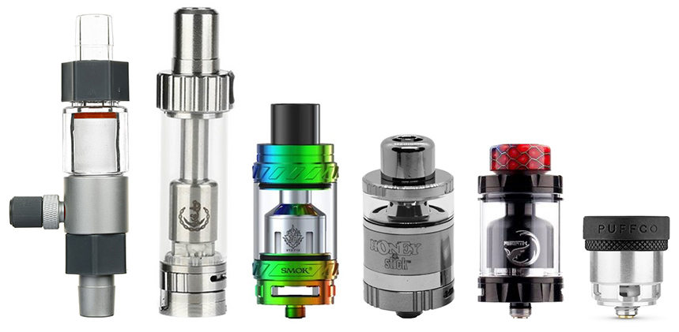

# Red Perfume


## Experimental CSS Atomizer (WIP)


Takes in CSS and HTML like this:

```css
.cow,
.cat {
    font-size: 12px;
    padding: 8px;
}
.dog {
    font-size: 12px;
    background: #F00;
    padding: 8px;
}
```
```html
<!DOCTYPE html>
<html>
  <head>
    <title>Test</title>
  </head>
  <body>
    <p class="cool cow moo">
      Hi there!
    </p>
    <!--
      <span class="dog">comments are skipped</span>
    -->
    <h1 class="cool cat nice wow">
      Meow
    </h1>
    <h2 class="dog">
      Woof
    </h2>
  </body>
</html>
```
Then atomizes the styling into atomic classes, and replaces the references to them:
```css
.rp__font-size__--COLON12px {
  font-size: 12px;
}
.rp__padding__--COLON8px {
  padding: 8px;
}
.rp__background__--COLON__--OCTOTHORPF00 {
  background: #F00;
}
```
```html
<!DOCTYPE html>
<html>
  <head>
    <title>Test</title>
  </head>
  <body>
    <p class="cool moo rp__font-size__--COLON12px rp__padding__--COLON8px">
      Hi there!
    </p>
    <!--
      <span class="dog">comments are skipped</span>
    -->
    <h1 class="cool nice wow rp__font-size__--COLON12px rp__padding__--COLON8px">
      Meow
    </h1>
    <h2 class="rp__font-size__--COLON12px rp__background__--COLON__--OCTOTHORPF00 rp__padding__--COLON8px">
      Woof
    </h2>
  </body>
</html>
```

This is already working as a proof of concept, however it needs a lot more work to be usable in production. Look at the **issues** page to see what work is left to be done and how you can help!


## Running locally to see the proof of concept

1. Install Node.js & npm
1. Download or fork or clone the repo
1. `npm install`
1. `node index.js`


## Why is it called "Red Perfume"

This library takes in any CSS and breaks it down to pure Atomic CSS. This is a process called "CSS Atomization", and libraries that do this process are called "CSS Atomizers".

Outside of our industry jargon, "Atomizer" already exists as a word.

> **Atomizer** <sub><sup>(*NOUN*)</sup></sub>
> 1. A device for emitting water, perfume, or other liquids as a fine spray.
> 
> \- [Oxford English Dictionary](https://www.lexico.com/definition/atomizer)

Though actual atomizers themselves have no consistent size, design, color, or shape. So there is no iconic image that represents them.



And though perfume bottles can also come in many shapes, colors, sizes and designs, they are still recognizable as perfume bottles.
